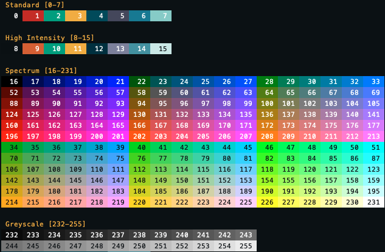

# Colorbase

Command line color database.



## Features

* Store and retrieve color palettes
* Convert between color formats (RGB, HSL, hex)

## Requirements

* GNU Make 3.82+
* CMake 3.10+

## Building

```sh
$ make
```


## Running

```sh
$ make run               # Option 1
$ ./build/bin/colorbase  # Option 2
```

## Installing

After building, the executable will be located at `./build/bin/colorbase`.
Move or copy that file to a location specified in the `PATH` environment
variable. For example…

```sh
$ mv ./build/bin/colorbase "${HOME}/bin/"
$ colorbase
```

List the locations in `PATH` by running the following command line…

```
$ echo $PATH
```

