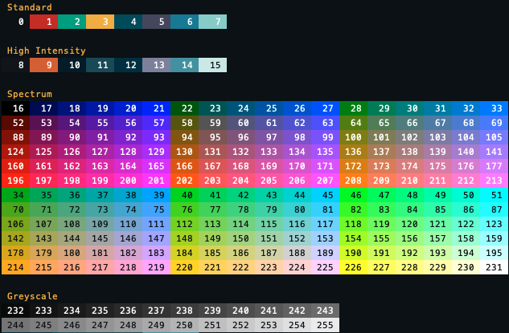

# ANSI 256

Terminal command that prints the ANSI 256 color tables



## Requirements

* GNU Make 3.82+
* CMake 3.10+

## Building

```sh
$ make
```


## Running

```sh
$ make run
$ ./build/bin/ansi256
```

## Installing

After building, the executable will be located at `./build/bin/ansi256`.
Move or copy that file to a location specified in the `PATH` environment
variable. For example…

```sh
$ mv ./build/bin/ansi256 "${HOME}/"
$ ansi256
```

List the locations in `PATH` by running the following command line…

```
$ echo $PATH
```

